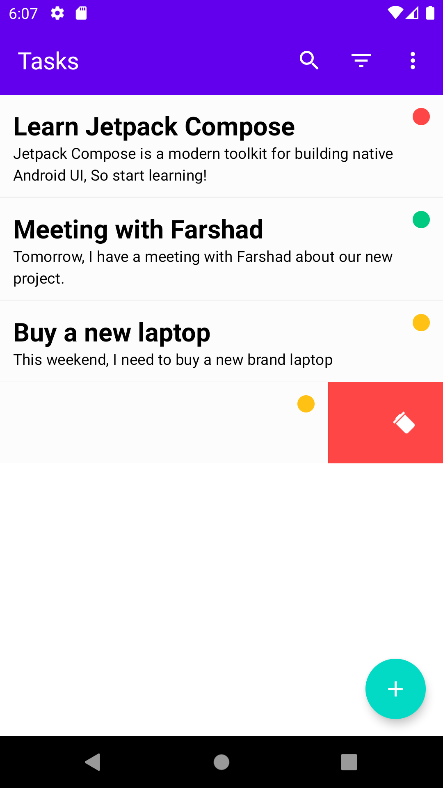
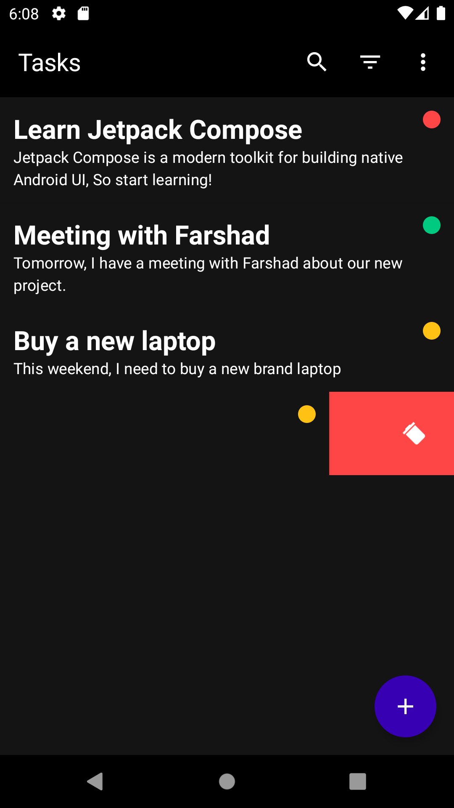

# ToDo
This sample is implemented using Jetpack Compose with MVVM architecture, Inspired by a Udemy course
from [Stevdza-San](https://www.udemy.com/course/to-do-app-with-jetpack-compose-mvvm-android-development/).

Also, I made some minor changes to have more challenges.

<table>
  <tr>
    <td> </td>
    <td></td>
   </tr> 
</table>
